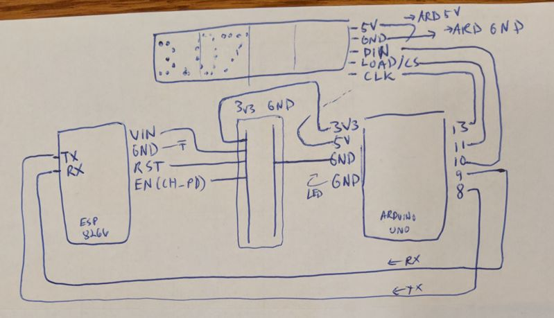

# Prawn Tank LED Heads-Up Display

This directory contains C code which implements an artifact
that receives status updates on the overall prawn tank system.
We use LED matrix electronics to display the status updates.
The updates are streamed via an in-home MQTT broker to a 
channel which contains pre-formatted text.

It requires an ESP8266 (or similar) microcontroller to be
wired to an Arduino, and one-way serial communication to be
established so that the ESP8266 can push the received updates
from the MQTT channel into the Arduino.

## Wiring diagram

## Troubleshooting

