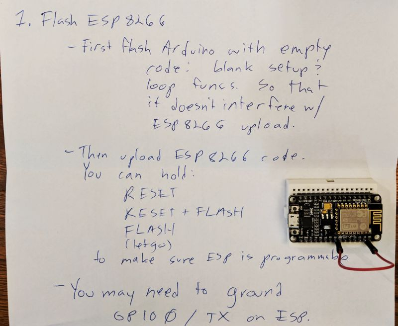

# Prawn Tank LED Heads-Up Display


This directory contains C code which implements an artifact
that receives status updates on the overall prawn tank system.
We use LED matrix electronics to display the status updates.
The updates are streamed via an in-home MQTT broker to a 
channel which contains pre-formatted text.

It requires an ESP8266 (or similar) microcontroller to be
wired to an Arduino, and one-way serial communication to be
established so that the ESP8266 can push the received updates
from the MQTT channel into the Arduino.

## Wiring diagram


## Overview of program upload procedure

To safeguard your sanity, we recommend uploading *empty code* to the Arduino.  This will prevent any existing instructions loaded into the Arduino from interfering with the ESP8266 when you're updating the ESP8266 with new code:

```
void setup() {}
void loop() {}
```

Now that the Arduino has nothing programmed into it, you're ready to upload the MQTT-receiving procedure to the ESP8266.

First, make sure that you edit the SSID and password appropriate in the ESP8266 ino file.

[Then, upload to the ESP8266](esp8266_receiver/esp8266_receiver.ino).  _You may need to disconnect the ESP8266 from the rest of the build entirely, and you may need to ground its GPIO 0 pin._

You're now ready to upload the _LED display code to the Arduino_.  [Upload this file to the Arduino](arduino_led/arduino_led.ino).

With those steps completed, make sure you have all the wiring in-tact as per the diagram, and plug in your masterpiece.  You'll need to wait about 15 seconds for the unit to initialize.  Enjoy!

## Troubleshooting

We found [this link to be particularly helpful](https://randomnerdtutorials.com/esp8266-troubleshooting-guide/).  _If all else fails, and you're unable to upload code to the ESP8266, ground GPIO 0!_



