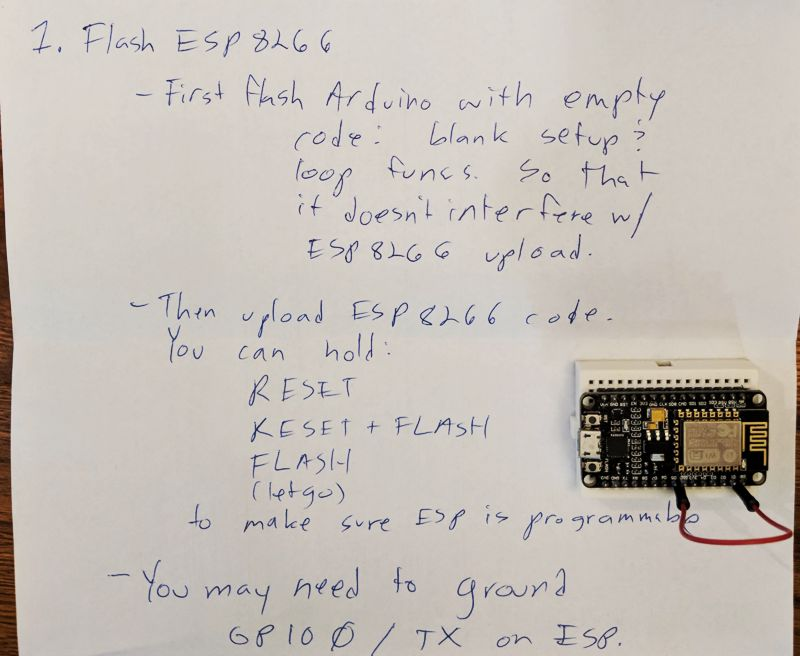

# Prawn Tank LED Heads-Up Display

This directory contains C++/ino code which implements an artifact
that receives status updates on the overall prawn tank system.
We use LED matrix electronics to display the status updates.
The updates are streamed via an in-home MQTT broker to a 
channel which contains pre-formatted text.

It requires an ESP8266 (or similar) microcontroller to be
powered indenpendently.  It requires a breadboard power supply
to provide 5 volts to the LED matrix.

## Parts list

* [8x8x4 LED matrix](https://smile.amazon.com/Wangdd22-MAX7219-Arduino-Microcontroller-Display/dp/B01EJ1AFW8)
* [ESP8266 microcontroller](https://smile.amazon.com/HiLetgo-Internet-Development-Wireless-Micropython/dp/B010N1SPRK)
* [Breadboard power supply](https://smile.amazon.com/gp/product/B016D5LB8U)
* A power source for the LED matrix: needs to supply <12 V via a 2.1mm plug, center pole positive
* A power source for the ESP8266 (cheap USB micro plug is fine)

## Wiring diagram

You can also [view the Fritzing diagram directly](LED_receiver_ESP8266_only_rev1.fzz).

### Troubleshooting

We found [this link to be particularly helpful](https://randomnerdtutorials.com/esp8266-troubleshooting-guide/).  _If all else fails, and you're unable to upload code to the ESP8266, ground GPIO 0!_

Flash with confidence after reading this article: https://tttapa.github.io/Pages/Arduino/ESP8266/Flashing/Flashing-With-an-Arduino.html

